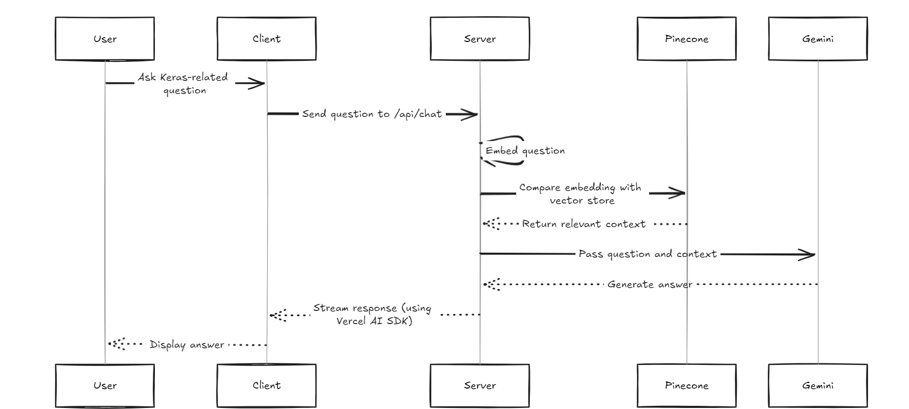
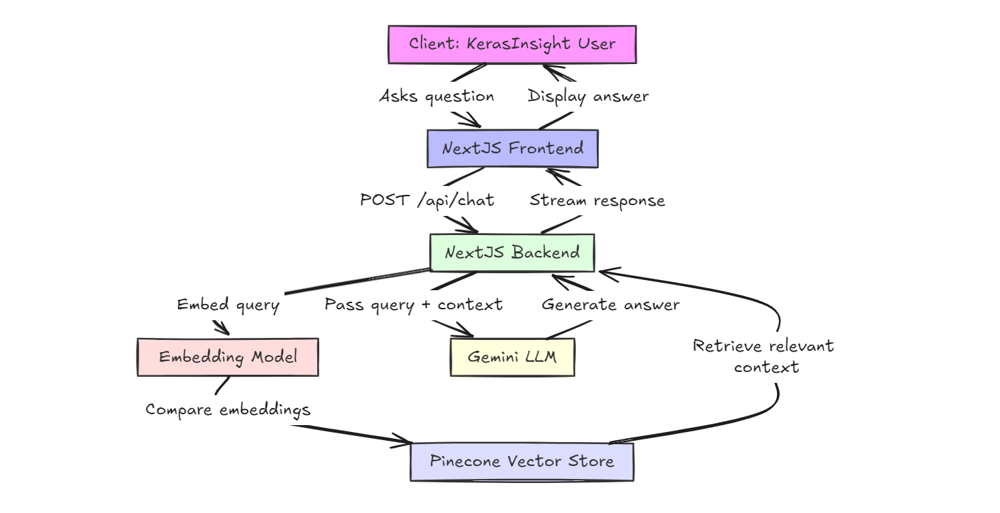
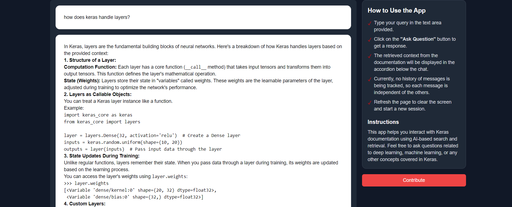

# Keras-Insight

Keras-Insight is an innovative AI-powered tool that combines the power of RAG (Retrieval-Augmented Generation) with the extensive Keras documentation. This project aims to provide developers with quick, accurate answers to their Keras-related questions, enhancing productivity and learning in the field of deep learning.


## Live Demo

Experience Keras-Insight in action: [https://keras-insight.vercel.app/](https://keras-insight.vercel.app/)

## Features

- **Intelligent Query Processing**: Utilizes advanced NLP techniques to understand and respond to user queries.
- **RAG System**: Leverages the entire Keras documentation for comprehensive and accurate responses.
- **Vector Store Integration**: Employs efficient information retrieval for fast and relevant results.
- **Next.js Frontend**: Offers a responsive and user-friendly interface.
- **Vercel AI SDK**: Enables smooth, streaming responses for an enhanced user experience.

## Project Architecture



Our system architecture ensures efficient processing of queries and generation of responses:



## Getting Started

### Prerequisites

- Node.js and npm
- Git

### Installation

1. Clone the repository:
   ```
   git clone https://github.com/Keerthan04/keras-insight.git
   cd keras-insight
   ```

2. Install dependencies:
   ```
   npm install
   ```

3. Set up credentials:
   To access the vector store, you'll need proper credentials. Please email ckeerthankumar4@gmail.com to request access.

4. Start the development server:
   ```
   npm run dev
   ```

5. Open [http://localhost:3000](http://localhost:3000) in your browser to see the application.

## Usage

1. Navigate to the playground page.
   

2. Enter your Keras-related question in the input field.

3. Submit your query and wait for the AI-generated response.
   

4. Explore the detailed, context-aware answers provided by Keras-Insight!

## Contributing

We welcome contributions to Keras-Insight! Whether it's bug fixes, feature additions, or documentation improvements, your input is valuable. Please feel free to submit pull requests or open issues on our GitHub repository.

## Contact

For any questions, suggestions, or collaboration inquiries, please contact:

Keerthan Kumar C - <ckeerthankumar4@gmail.com>

## Acknowledgments

- Keras Documentation
- Vercel for hosting and Vercel AI SDK
- All contributors and supporters of this project

Thank you for your interest in Keras-Insight. I'am excited to see how this tool can assist the deep learning community!
